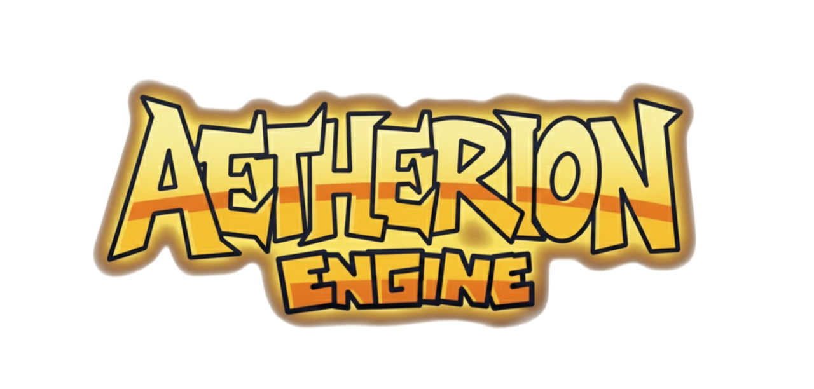

<p align="center">
  
</p>

<h1 align="center">🎵 Aetherion Engine</h1>
<p align="center">
  <b>An enhanced and stable rework of Psych Engine 0.6.3 — lighter, faster, and modder-friendly!</b><br/>
  <a href="https://github.com/azur-fnf/AetherionEngine/releases/latest">
    
  </a>
  
  
  
</p>

---

## 📦 About Aetherion Engine
**Aetherion Engine** is a reworked version of the [Psych Engine](https://github.com/ShadowMario/FNF-PsychEngine), designed to provide smoother performance, modern tools, and a cleaner modding experience.

Originally based on the engine used in the [Mind Games Mod](https://gamebanana.com/mods/301107), Aetherion aims to fix bugs, improve compatibility, and simplify mod creation — all while keeping the fun and freedom of the original.

---

## 🛠️ Installation

### 1️⃣ Requirements
- [Haxe (4.2.5)](https://haxe.org/download/)
- [Git](https://git-scm.com/)
- [Visual Studio Build Tools (for Windows compilation)](https://visualstudio.microsoft.com/visual-cpp-build-tools/)

### 2️⃣ Dependencies
Open **PowerShell** or **Command Prompt** in your engine folder and run:

```bash
haxelib install lime 7.7.0
haxelib install openfl 8.9.7
haxelib install flixel 4.11.0
haxelib install flixel-tools
haxelib install flixel-ui
haxelib install flixel-addons
haxelib install hxcpp
haxelib git linc_luajit https://github.com/nebulazorua/linc_luajit
haxelib install hxCodec
```

If you want Discord RPC support:

```bash
haxelib install hxdiscord_rpc
```

---

## ▶️ Compiling the Game

After installation, compile with:

```bash
lime test windows
```

If you want a one-click install and build, use the included `setup.bat` ❤️

---

## 🌟 Features

* Smooth animated dialogue boxes
* Full `.lua` mod support
* Reworked Chart Editor with event notes
* Customizable menus and HUD
* Optional Discord Rich Presence
* Optimized performance and stability

---

## 👥 Credits

| Role                       | Contributors                                                         |
| -------------------------- | -------------------------------------------------------------------- |
| Psych Engine Creator       | [Shadow Mario](https://github.com/ShadowMario)                       |
| LuaJIT Integration         | [Nebula the Zorua](https://github.com/nebulazorua)                   |
| Aetherion Engine Developer | [Azurion-Chan](https://github.com/azur-fnf)                          |
| Special Thanks             | bbpanzu, RiverOaken, KadeDev, iFlicky, PolybiusProxy, Keoiki, Smokey |

---

## 🧠 Extras

* **Docs:** see the [`docs/`](docs/) folder
* **Logo:** [`docs/img/logo.png`](docs/img/logo.png)
* **Current Version:** `v0.6.3a`
* **Compatibility:** Windows / Linux / *(WIP: Android)*

---

<p align="center">
  Made with 💙 by <b>Azurion-Chan</b><br/>
  <sub>“Aetherion Engine — where every note shines.”</sub>
</p>
