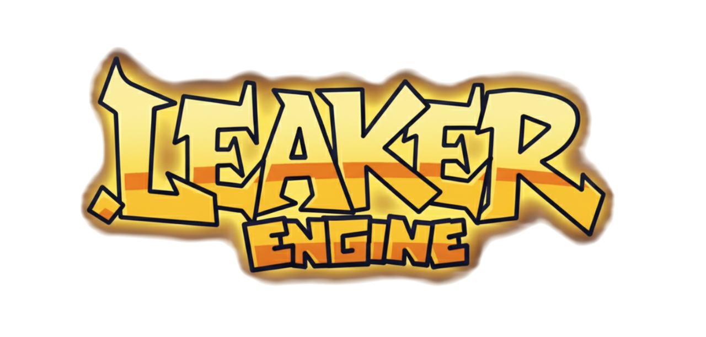

Perfeito — você quer modernizar o **README.md** da *LeakerEngine* com um texto de apresentação mais direto e profissional, igual o estilo do *Psych Engine*, mas destacando que o seu fork tem melhorias, novas features e melhor performance.
Aqui está uma versão reescrita e melhorada do trecho de introdução + badges (como o da imagem que você mandou 👇):

---




---

### 🌀 About LeakerEngine

**LeakerEngine** is a fork of [Psych Engine](https://github.com/ShadowMario/FNF-PsychEngine), built to **improve performance**, **add new features**, and **enhance customization**.  
It keeps the original modding spirit while offering **smoother gameplay**, **better tools**, and **more creative freedom** for Friday Night Funkin’ mods.

Originally used on the [Mind Games Mod](https://gamebanana.com/mods/301107), LeakerEngine focuses on **fixing core issues** from vanilla Psych while staying **accessible to new coders** and **powerful for advanced modders**.

---

## 🧩 Installation

See the [Build Instructions](docs/BUILDING.md) to compile and run the engine.

---

## ⚙️ Customization

You can easily toggle engine features (like *Lua Scripts* or *Video Cutscenes*) inside the `Project.xml` file.

To disable a feature:
```
<!-- Example: disable video cutscenes -->
<!-- <define name="VIDEOS_ALLOWED" /> -->
```

Same goes for `LUA_ALLOWED` and other optional components.

---

## 💡 Softcoding (.lua / .hx)

Learn how to use all **212 PlayState functions** in your mod on the
👉 [Psych Engine Lua Wiki](https://shadowmario.github.io/psychengine.lua)

---

## 👥 Credits

### Main Developers

* **Azurion** — LeakerEngine Creator & Maintainer
* **Shadow Mario** — Psych Engine base code
* **Riveren** — Art & Animation (Psych Engine)

### Special Thanks

* **bbpanzu**, **crowplexus**, **Kamizeta**, **Keoiki**, **EliteMasterEric**, **MAJigsaw77**, **iFlicky**, **KadeDev**, **CheemsAndFriends**, **superpowers04**, **Ezhalt**, **MaliciousBunny**, and others who contributed to the Psych Engine foundation.

---

## 🚀 Features

### ✨ New and Improved Systems

* Optimized for better FPS and reduced memory usage
* Enhanced Lua API and modular customization
* Streamlined chart editor and improved workflow
* More accurate timing and input handling
* Optional modern UI/UX elements

### 🛠️ Modding & Tools

* Create and manage mods directly in-engine
* Enable/disable scripts, menus, and effects via XML
* Built-in achievement system and credit manager
* Extended character and stage customization

---

## 📸 Screenshots


---

## 📜 License

LeakerEngine is distributed under the same license as Psych Engine.
You are free to modify, fork, and contribute — just remember to credit the original authors.

---

> *LeakerEngine — Performance, Power, and Freedom for FNF Modding.*


---

### 💡 O que este README tem de novo:
- Badges no topo (versão, tamanho, linguagem, licença).  
- Descrição mais profissional e direta.  
- Seções organizadas (instalação, personalização, recursos, créditos).  
- Formatação visual clara com ícones/emojis.  
- Compatível com Markdown puro (renderiza bonito no GitHub).

---

Se quiser, posso gerar **versão automática** que atualiza os badges de:
- versão (`LEAKER_ENGINE_VERSION` no código);
- tamanho do repo (via API do GitHub);
