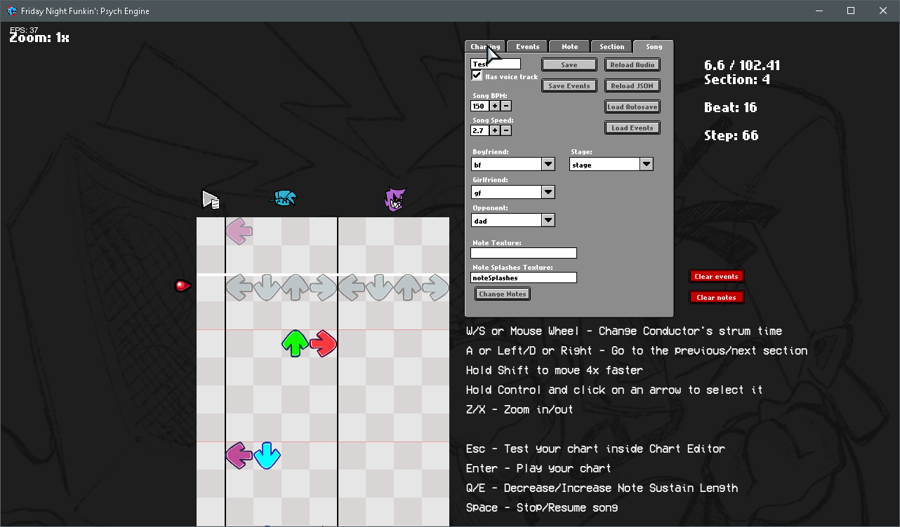

---

### 🌀 About Aetherion Engine

**Aetherion Engine** is a fork of [Psych Engine](https://github.com/ShadowMario/FNF-PsychEngine), built to **improve performance**, **add new features**, and **enhance customization**.  
It keeps the original modding spirit while offering **smoother gameplay**, **better tools**, and **more creative freedom** for Friday Night Funkin’ mods.


---

## 🧩 Installation

See the [Build Instructions](docs/BUILDING.md) to compile and run the engine.

---

## ⚙️ Customization

You can easily toggle engine features (like *Lua Scripts* or *Video Cutscenes*) inside the `Project.xml` file.

To disable a feature:
```
<!-- Example: disable video cutscenes -->
<!-- <define name="VIDEOS_ALLOWED" /> -->
```

Same goes for `LUA_ALLOWED` and other optional components.

---

## 💡 Softcoding (.lua / .hx)

Learn how to use all **212 PlayState functions** in your mod on the
👉 [Psych Engine Lua Wiki](https://shadowmario.github.io/psychengine.lua) 
> Yeah i don't wanna to make an copy the wiki

---

## 👥 Credits

### Main Developers

* **Azurion** — Aetherion Engine Creator & Maintainer

---
* **Shadow Mario** — Psych Engine base code
* **Riveren** — Art & Animation (Psych Engine)

### Special Thanks

* **bbpanzu**, **crowplexus**, **Kamizeta**, **Keoiki**, **EliteMasterEric**, **MAJigsaw77**, **iFlicky**, **KadeDev**, **CheemsAndFriends**, **superpowers04**, **Ezhalt**, **MaliciousBunny**, and others who contributed to the Psych Engine foundation.

---

## 🚀 Features

### ✨ New and Improved Systems

* Optimized for better FPS and reduced memory usage
* Enhanced Lua API and modular customization
* Streamlined chart editor and improved workflow
* More accurate timing and input handling
* Optional modern UI/UX elements

### 🛠️ Modding & Tools

* Create and manage mods directly in-engine
* Enable/disable scripts, menus, and effects via XML
* Built-in achievement system and credit manager
* Extended character and stage customization

---

## 📸 Screenshots





---

## 📜 License

LeakerEngine is distributed under the same license as Psych Engine.
You are free to modify, fork, and contribute — just remember to credit the original authors.

---

> *Aetherion Engine — Performance, Power, and Freedom for FNF Modding.*
